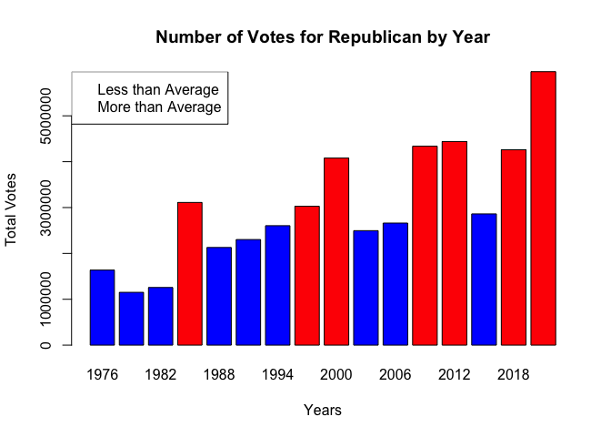
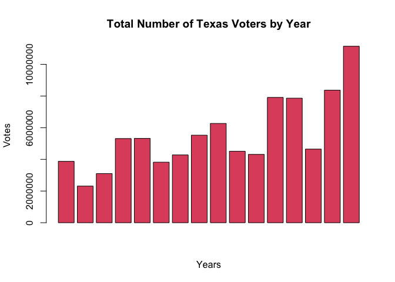
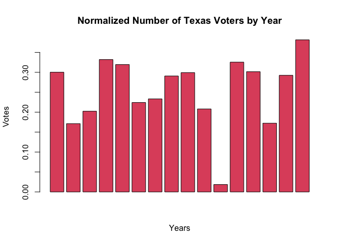

U.S. Senate 1976-2020 Harvard Dataverse Snapshot
================
Yoshita Narang
2022-09-27

## Introduction

In this project, I will perform an exploratory analysis on data provided
by MIT Election Data & Science Lab (Massachusetts Institute of
Technology) (MEDSL), curated by the Harvard Dataverse. This data file
contains constituency (state-level) returns for elections to the U.S.
Senate from 1976 to 2020. My primary focus is to implement efficient
Data Visualization procedures that ensure effective presentation of data
to non-technical audiences without confusion. In doing so, I will
compare election rates between candidates of different parties to better
interpret the data, and create visual elements that provide an
accessible way to see and understand election trends.

## Data Collection & Wrangling

Here, each state provides different information. Even where the
information is the same, the column names and formats are sometimes
different. To make things as simple as possible when we get to the
actual exploration, we should trim and clean the data. Cleaning the data
makes sure that the data formats across the cities are consistent, while
trimming focuses only on the parts of the data we are most interested in
to make the exploration easier to work with.

``` r
# Set working directory to where the file is located 
setwd("~/Library/CloudStorage/Box-Box/dataverse_files")
library(readr)
# Read the data in its original format (.csv) by using the function read.csv()
senate_data <- read_csv("1976-2020-senate.csv")
```

    ## Rows: 3629 Columns: 19
    ## ── Column specification ────────────────────────────────────────────────────────
    ## Delimiter: ","
    ## chr (9): state, state_po, office, district, stage, candidate, party_detailed...
    ## dbl (7): year, state_fips, state_cen, state_ic, candidatevotes, totalvotes, ...
    ## lgl (3): special, writein, unofficial
    ## 
    ## ℹ Use `spec()` to retrieve the full column specification for this data.
    ## ℹ Specify the column types or set `show_col_types = FALSE` to quiet this message.

``` r
# Turn the variables: year, state, and party simplified into factor variable
# Implement as.factor(), an R function that converts a column from numeric to factor
senate_data$year <- as.factor(senate_data$year)
senate_data$state <- as.factor(senate_data$state)
senate_data$party_simplified <- as.factor(senate_data$party_simplified)
```

## Subsetting Data

Here, I will focus on sub-setting the data for the state of Texas. My
primary focus is denoting common trends between Republican and
Democractic candidates within those specified borders in the years given
(1976-2020. he code below performs basic data manipulations using main R
code

``` r
## Subset dataset by extracting the data for only Texas
## Keep columns: year, state, candidatevotes, totalvotes, and party simplified.
texas_subset <- senate_data[senate_data$state == "TEXAS", c(1:2, 15:16, 19)]
```

``` r
# (c)
# Calculate the average # of votes for each party, using the lapply function
mean_votes <- lapply(texas_subset[which(texas_subset$party_simplified == 
"DEMOCRAT"), "candidatevotes"], mean) # [1] 2416258
mean_votes <- lapply(texas_subset[which(texas_subset$party_simplified == 
"REPUBLICAN"), "candidatevotes"], mean) # [1] 3019937
mean_votes <- lapply(texas_subset[which(texas_subset$party_simplified == 
"LIBERTARIAN"), "candidatevotes"], mean) # [1] 92815
mean_votes <- lapply(texas_subset[which(texas_subset$party_simplified == 
"OTHER"), "candidatevotes"], mean) # [1] 21533
```

``` r
# Calculate the median number of votes for each party, using the lapply function
median_votes <- lapply(texas_subset[which(texas_subset$party_simplified == 
"DEMOCRAT"), "candidatevotes"], median) # [1] 2112490
median_votes <- lapply(texas_subset[which(texas_subset$party_simplified == 
"REPUBLICAN"), "candidatevotes"], median) # [1] 2761660
median_votes <- lapply(texas_subset[which(texas_subset$party_simplified ==
"LIBERTARIAN"), "candidatevotes"], median) # [1] 72657
median_votes <- lapply(texas_subset[which(texas_subset$party_simplified == 
"OTHER"), "candidatevotes"], median) # [1] 4564
```

``` r
# (d)
# Create function to identify the years in which a Texas democratic candidate won
years_won <- vector()
democratic_years_won <- function() {
  # Set variables equal to 0, to give it a placeholder value until the for loop
  # is iterated 
  current_year <- 0
  index <- 1
  vote_count <- 0
  
  for (i in 1:length(texas_subset$party_simplified)){
    if (as.character(texas_subset$year[i]) != as.character(current_year)){
      if (as.character(texas_subset$party_simplified[index]) == "DEMOCRAT"){
        years_won <- append(years_won, as.character(texas_subset$year[index]))
        }
      current_year <- as.character(texas_subset$year[i])
      vote_count <- 0
      index <- 0
      }
    if (as.integer(vote_count) == 0){
        vote_count <- as.integer(texas_subset$candidatevotes[i])
        }
    if (as.integer(texas_subset$candidatevotes[i]) >= as.integer(vote_count)){ 
      vote_count <- as.integer(texas_subset$candidatevotes[i])
      index <- as.integer(i)
    }
    i <- i + 1 
  }
  # Return years_won vector 
  return(years_won)
}
# Call function to display the years in which a democratic candidate from Texas won
print(democratic_years_won()) # [1] "1976" "1982" "1988"
```

    ## [1] "1976" "1982" "1988"

``` r
# (e)
# Create a barplot that shows the # of votes for republican by year, then compute 
# its average over years. 
yearly_votes <- vector() # Derived from Texas subset 
votes_counter <- vector() # A counter for Republican votes by the year 
for (i in 1:length(texas_subset$party_simplified)){
  if (texas_subset$party_simplified[i] == "REPUBLICAN"){
    votes_counter <- append(votes_counter, as.character(texas_subset$candidatevotes[i]))
    yearly_votes <- append(yearly_votes, as.character(texas_subset$year[i]))
    } 
  }
# If the votes that republican got is less than the above average, then color 
# that bar in blue, otherwise color the bar in red
index <- which(as.integer(votes_counter) <= mean(as.integer(votes_counter)))
bars <- votes_counter
bars[index] <- "blue"
for (i in 1:length(bars)) {
if (as.character(bars[i]) != "blue") {
    bars[i] <- "red"
  }
}
# Use of set_options to omit the use of scientific notation, and make reading 
# the graph more simplified 
set_options = options()
options(scipen = 8)
# Accurately curate labels for the barplot
barplot(as.integer(votes_counter), as.integer(yearly_votes),
        main = "Number of Votes for Republican by Year", col = bars,
        names.arg = yearly_votes, ylab = "Total Votes", xlab = "Years")
legend("topleft", legend = c("Less than Average", "More than Average"))
```



``` r
# (f)
# Create 2 vectors, voting_yrs and sum_votes 
voting_yrs <- vector()
sum_votes <- vector() # Used as a counter for total votes 
current_yr <- 0
  for(i in 1:length(texas_subset$party_simplified)){
    if(texas_subset$year[i] != current_yr){
      voting_yrs <- append(voting_yrs, as.character(texas_subset$year[i]))
      sum_votes <- append(sum_votes, texas_subset$totalvotes[i])
      current_yr <- texas_subset$year[i]
      }
    i <- i + 1
    }
# Using the statistics provided by usafacts.org, the vector, tx_yearly_population, holds
# the yearly population for the state of Texas, by the voting years (16 voting years)
yearly_index <- rep(1, 16)
tx_yearly_population <- c(12904089, 13500429, 15331415, 16007086, 16667022, 17044714,
                            18338319, 19006240, 20944499, 21690325, 233559580, 24309039,
                            26084120, 26963092, 28624564, 29217653)
# Use of set_options to omit the use of scientific notation, and make reading 
# the graph more simplified 
set_options = options()
options(scipen = 9)
# Create a barplot of the total number of voters by year. 
barplot(as.integer(sum_votes), main = "Total Number of Texas Voters by Year", 
        col = 2, ylab = "Votes", xlab = "Years")
```



``` r
# Create Vector to normalize total # of votes per year, by dividing by the population 
# of Texas for the given year
divided_votes <- vector()
for (i in 1:length(sum_votes)) { divided_votes <- append(divided_votes,
     as.integer(sum_votes[i]) / tx_yearly_population[i])
    i <- i + 1
}
# Create barplot of normalized data 
barplot(divided_votes, main = "Normalized Number of Texas Voters by Year", 
        ylab = "Votes", xlab = "Years", col = 2)
```


